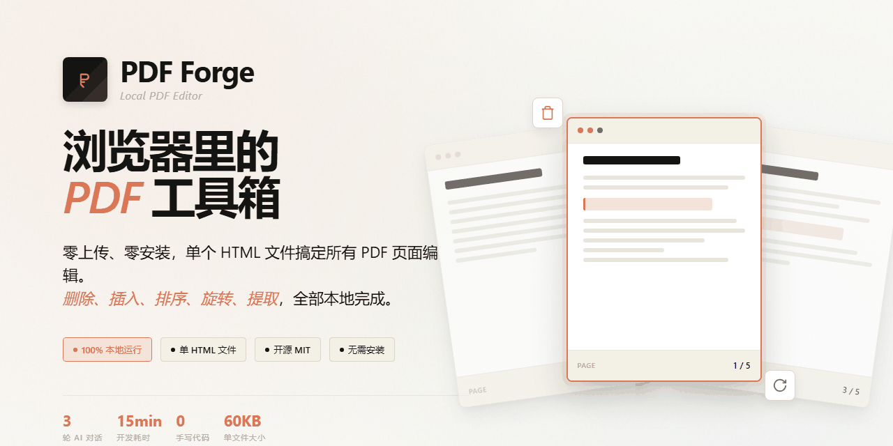
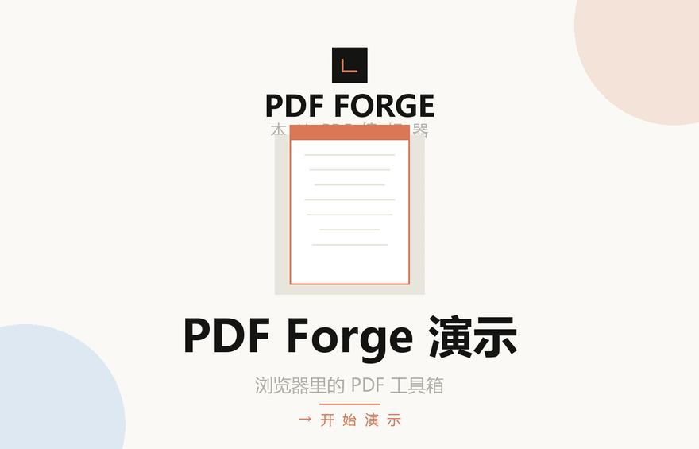
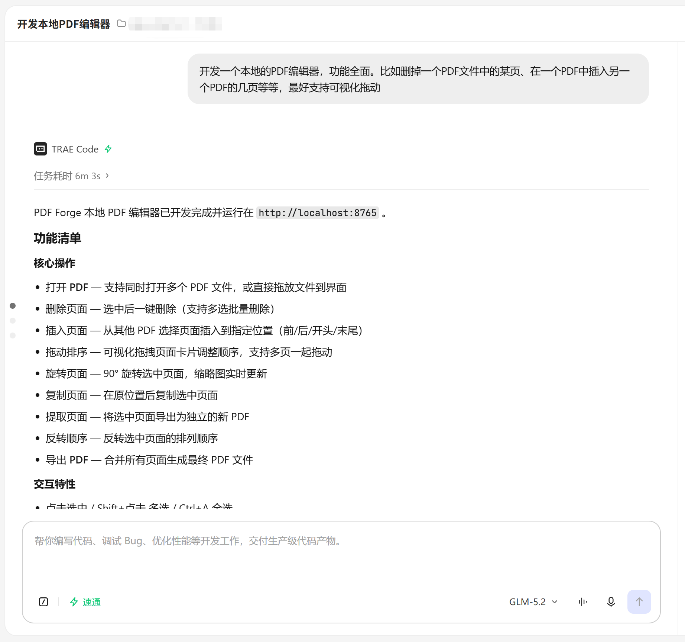
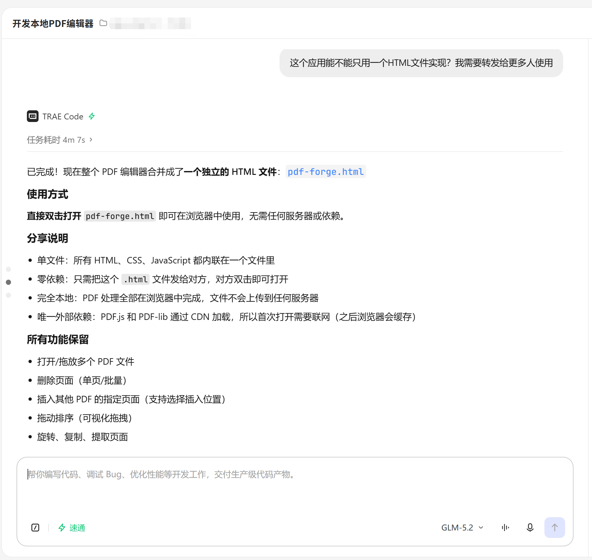
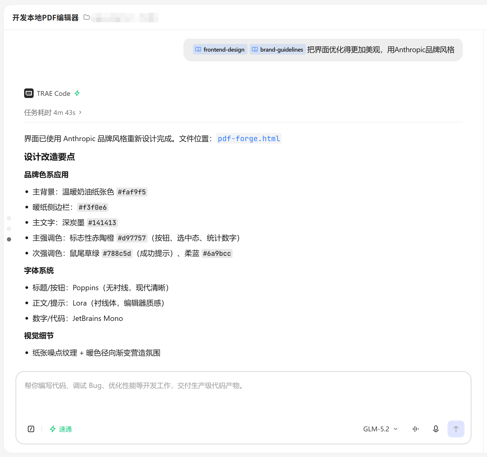

  
  
  

  

  
  
  
  

# PDF Forge — 3回のAI会話で完成したローカル PDF エディタ

> 🚀 **わずか3回の AI 会話で完成: コア機能 → 単一ファイル化 → UI 美化。100% Vibe Coding、手書きコードゼロ。**

ブラウザ内で完全に動作する PDF 編集ツール。**HTML ファイル1つだけ**で完結 — サーバー不要、インストール不要、ファイルアップロード不要。すべての処理はローカルで実行されます。

Anthropic ブランドスタイルのエレガントなデザインで、PDF ページ編集の全機能をサポート。

---

## ✨ コア機能

### ページ操作
- 📂 **PDF を開く**: 複数 PDF ファイルを同時に開く、ドラッグ&ドロップ対応
- 🗑️ **ページ削除**: ワンクリック削除、複数選択一括削除対応
- ➕ **ページ挿入**: 他の PDF から任意の位置（前/後/先頭/末尾）に挿入
- 🔀 **ドラッグ並び替え**: ページカードのドラッグ&ドロップで順序変更、複数同時移動対応
- 🔄 **ページ回転**: 90°回転、サムネイルがリアルタイム更新
- 📋 **ページ複製**: 選択したページの直後に複製
- 📤 **ページ抽出**: 選択したページを別 PDF として書き出し
- ↔️ **順序反転**: 選択ページの順序を反転
- 💾 **PDF エクスポート**: 全ページを結合して最終 PDF を生成

### インタラクション機能
- ⌨️ 完全なキーボードショートカット対応
- 🖱️ サムネイルズーム制御（50%~200%）
- 📁 サイドバー幅調整可能
- 📊 リアルタイム統計（総ページ数/選択数/ファイル数）
- 🔔 操作結果のトースト通知
- 🎨 エレガントな Anthropic ブランドスタイル UI、紙の質感

---

## 🚀 使い方

### 直接使用
1. `pdf-forge.html` をローカルにダウンロード
2. ダブルクリックでブラウザで開く（Chrome/Edge/Firefox 推奨）
3. 初回は PDF.js と PDF-lib 依存を CDN から読み込みが必要（以降はオフライン可）

### 共有方法
`pdf-forge.html` ファイルを送るだけ。受け取った相手はダブルクリックで使え、インストール不要。

---

## ⌨️ ショートカット

| ショートカット | 機能 |
|----------|------|
| ページクリック | 単一ページ選択 |
| `Shift + クリック` | 範囲選択 |
| `Delete` / `Backspace` | 選択ページ削除 |
| `Ctrl + A` | 全選択/解除 |
| `Ctrl + S` | PDF エクスポート |
| `Esc` | 選択解除 / ダイアログを閉じる |
| ドラッグ | ページ並び替え |

---

## 🛠️ 技術スタック
- **PDF レンダリング**: [PDF.js](https://mozilla.github.io/pdf.js/)
- **PDF 処理**: [PDF-lib](https://pdf-lib.js.org/)
- **純粋フロントエンド**: HTML + CSS + バニラ JavaScript、フレームワーク不要
- **単一ファイル**: コードすべて 1 つの HTML ファイルにインライン、60KB 未満

---

## 🎯 3回の AI 会話の過程

このプロジェクトは AI 会話のみで生成、手書きコード **ゼロ**、**わずか3プロンプト**、合計15分未満で完成:

### 🟢 第1ラウンド: ゼロからコア機能を構築
**プロンプト:** "本地的PDF编辑器を開発してください。機能全面。例えばPDFファイル中の某ページを削除、別のPDFの数ページをあるPDFに挿入など、最好支持可视化拖动"
- 時間: 6分3秒
- すべてのコア機能完成: 開く、削除、挿入、ドラッグ並び替え、回転、複製、抽出、エクスポート

### 🟡 第2ラウンド: 単一ファイル化で共有しやすく
**プロンプト:** "このアプリは1つの HTML ファイルだけで実現できますか？より多くの人に転送したいんです"
- 時間: 4分7秒
- すべての HTML/CSS/JS を 1 ファイルにインライン化、依存ゼロ

### 🔴 第3ラウンド: 本番レベルの UI 美化
**プロンプト:** "インターフェースをより美しく最適化、Anthropic ブランドスタイルで"
- 時間: 4分43秒
- UI 完全再設計: Anthropic ブランドカラー、タイポグラフィ、紙の質感、動的エフェクト — プロフェッショナル品質

---

## 📦 サンプルファイル

`sample-pdfs/` ディレクトリにはテスト用 PDF が2つ含まれています:
- `sample-report.pdf` - 4ページ 年次ビジネスレポート
- `sample-manual.pdf` - 3ページ ユーザーマニュアル

---

## 🔒 プライバシー
すべての PDF 処理はブラウザ内で完結。**ファイルはサーバーにアップロードされません**。

---

## 📄 ライセンス
[MIT License](LICENSE)
